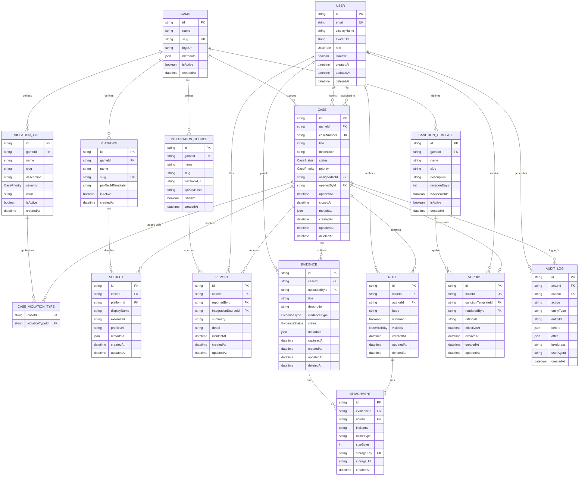

# CCIP Data Model

> **Cheater Case Intelligence Platform** — Data Architecture Reference  
> Last updated: 2026-06-16 | Version 2.0.0

---

## Table of Contents

1. [Overview](#1-overview)
2. [Entity-Relationship Diagram](#2-entity-relationship-diagram)
3. [Prisma Schema](#3-prisma-schema)
4. [Entity Reference](#4-entity-reference)
   - [Game](#41-game)
   - [Platform](#42-platform)
   - [ViolationType](#43-violationtype)
   - [SanctionTemplate](#44-sanctiontemplate)
   - [IntegrationSource](#45-integrationsource)
   - [User](#46-user)
   - [Case](#47-case)
   - [Subject](#48-subject)
   - [Report](#49-report)
   - [Evidence](#410-evidence)
   - [Attachment](#411-attachment)
   - [Note](#412-note)
   - [Verdict](#413-verdict)
   - [AuditLog](#414-auditlog)
5. [Relationships Summary](#5-relationships-summary)
6. [Enum Reference](#6-enum-reference)
7. [Seed File](#7-seed-file)
8. [Design Decisions & Conventions](#8-design-decisions--conventions)

---

## 1. Overview

The Cheater Case Intelligence Platform (CCIP) is a case-management and intelligence system for tracking, investigating, and adjudicating cheating allegations. It is designed to be **game-agnostic and studio-ready**: every list of options (cheat types, platforms, penalties, ingest sources) lives in the database as configurable records rather than hardcoded enum values. A new studio installs the repo, edits the seed file for their title, runs `prisma db seed`, and the platform is fully configured — no schema changes required.

### Architecture at a Glance

```
Game  ←── the top-level tenant (one per title, or shared across a studio's portfolio)
 │
 ├── Platform[]           Steam, Xbox Live, PSN, Epic — seeded per studio
 ├── ViolationType[]      Aimbot, Wallhack, Boosting — seeded per game
 ├── SanctionTemplate[]   7-day ban, perm ban, warning — seeded per game
 ├── IntegrationSource[]  EAC, VAC, custom ML pipeline — plugged in per game
 └── Case[]
      ├── Subject[]        → Platform
      ├── Report[]         → IntegrationSource
      ├── ViolationType[]  (via CaseViolationType)
      ├── Evidence[]
      ├── Note[]
      └── Verdict          → SanctionTemplate
```

### Core Principles

| Principle | Implementation |
|---|---|
| Game-agnostic | All game-specific lists are config tables, not enums |
| Case-centric | Every investigative entity relates back to a `Case` |
| Immutable audit trail | `AuditLog` is append-only; no updates or deletes |
| Soft deletes | Primary entities use `deletedAt` rather than hard deletes |
| Role-based access | `User.role` gates read/write/admin operations |
| Extensibility | `metadata` JSONB fields on key models for custom attributes |
| Customization via seed | Studios configure their title in `prisma/seed.ts`, not in schema |

---

## 2. Entity-Relationship Diagram



---

## 3. Prisma Schema

```prisma
// ============================================================
// CCIP — Prisma Schema
// Database: PostgreSQL 18
// Version:  2.0.1 — extensible, game-agnostic
// ============================================================

generator client {
  provider = "prisma-client-js"
}

datasource db {
  provider = "postgresql"
  url      = env("DATABASE_URL")
}

// ─────────────────────────────────────────
// STABLE ENUMS
// These are universal workflow states that
// do not vary by game. All game-specific
// "lists of options" are config tables below.
// ─────────────────────────────────────────

enum UserRole {
  VIEWER
  ANALYST
  SENIOR_ANALYST
  ADMIN
}

enum CaseStatus {
  OPEN
  UNDER_REVIEW
  PENDING_EVIDENCE
  ESCALATED
  CLOSED
  DISMISSED
}

enum CasePriority {
  LOW
  MEDIUM
  HIGH
  CRITICAL
}

enum EvidenceType {
  SCREENSHOT
  VIDEO
  LOG_FILE
  REPLAY_FILE
  EXTERNAL_REPORT
  API_DATA
  OTHER
}

enum EvidenceStatus {
  PENDING_REVIEW
  VERIFIED
  DISPUTED
  REJECTED
}

enum NoteVisibility {
  INTERNAL       // ANALYST and above
  RESTRICTED     // SENIOR_ANALYST and above
  CONFIDENTIAL   // ADMIN only
}

// ─────────────────────────────────────────
// GAME  (top-level tenant)
// ─────────────────────────────────────────

model Game {
  id        String   @id @default(cuid())
  name      String                         // "Apex Legends"
  slug      String   @unique               // "apex-legends"
  logoUrl   String?
  metadata  Json?
  isActive  Boolean  @default(true)
  createdAt DateTime @default(now())

  // Config children
  platforms          Platform[]
  violationTypes     ViolationType[]
  sanctionTemplates  SanctionTemplate[]
  integrationSources IntegrationSource[]

  // Cases
  cases Case[]

  @@map("games")
}

// ─────────────────────────────────────────
// PLATFORM  (config table)
// ─────────────────────────────────────────

model Platform {
  id                  String   @id @default(cuid())
  gameId              String?                       // null = cross-game platform
  name                String                        // "Steam"
  slug                String   @unique              // "steam"
  profileUrlTemplate  String?
  // e.g. "https://steamcommunity.com/profiles/{{externalId}}"
  isActive            Boolean  @default(true)
  createdAt           DateTime @default(now())

  game     Game?     @relation(fields: [gameId], references: [id])
  subjects Subject[]

  @@index([gameId])
  @@map("platforms")
}

// ─────────────────────────────────────────
// VIOLATION TYPE  (config table)
// Replaces: Tag + CaseTag + EvidenceType classification
// ─────────────────────────────────────────

model ViolationType {
  id          String       @id @default(cuid())
  gameId      String
  name        String                              // "Aimbot"
  slug        String                              // "aimbot"
  description String?
  severity    CasePriority @default(MEDIUM)       // reuses stable enum
  color       String       @default("#6B7280")    // hex color for UI badge
  isActive    Boolean      @default(true)
  createdAt   DateTime     @default(now())

  game  Game               @relation(fields: [gameId], references: [id])
  cases CaseViolationType[]

  @@unique([gameId, slug])
  @@index([gameId])
  @@map("violation_types")
}

// Join table: Case ↔ ViolationType
model CaseViolationType {
  caseId          String
  violationTypeId String

  case          Case          @relation(fields: [caseId],          references: [id], onDelete: Cascade)
  violationType ViolationType @relation(fields: [violationTypeId], references: [id], onDelete: Cascade)

  @@id([caseId, violationTypeId])
  @@map("case_violation_types")
}

// ─────────────────────────────────────────
// SANCTION TEMPLATE  (config table)
// Replaces: VerdictOutcome enum
// ─────────────────────────────────────────

model SanctionTemplate {
  id           String   @id @default(cuid())
  gameId       String
  name         String                       // "Permanent Hardware Ban"
  slug         String                       // "permanent-hardware-ban"
  description  String?
  durationDays Int?                         // null = permanent
  isAppealable Boolean  @default(true)
  isActive     Boolean  @default(true)
  createdAt    DateTime @default(now())

  game     Game      @relation(fields: [gameId], references: [id])
  verdicts Verdict[]

  @@unique([gameId, slug])
  @@index([gameId])
  @@map("sanction_templates")
}

// ─────────────────────────────────────────
// INTEGRATION SOURCE  (config table)
// Replaces: ReportSource enum
// ─────────────────────────────────────────

model IntegrationSource {
  id         String   @id @default(cuid())
  gameId     String
  name       String                       // "Easy Anti-Cheat"
  slug       String                       // "easy-anti-cheat"
  webhookUrl String?
  apiKeyHash String?                      // hashed — never store plaintext
  isActive   Boolean  @default(true)
  createdAt  DateTime @default(now())

  game    Game     @relation(fields: [gameId], references: [id])
  reports Report[]

  @@unique([gameId, slug])
  @@index([gameId])
  @@map("integration_sources")
}

// ─────────────────────────────────────────
// USER
// ─────────────────────────────────────────

model User {
  id          String    @id @default(cuid())
  email       String    @unique
  displayName String
  avatarUrl   String?
  role        UserRole  @default(VIEWER)
  isActive    Boolean   @default(true)
  createdAt   DateTime  @default(now())
  updatedAt   DateTime  @updatedAt
  deletedAt   DateTime?

  casesOpened   Case[]     @relation("CaseOpenedBy")
  casesAssigned Case[]     @relation("CaseAssignedTo")
  reports       Report[]
  evidence      Evidence[]
  notes         Note[]
  verdicts      Verdict[]
  auditLogs     AuditLog[]

  @@index([email])
  @@index([role])
  @@index([isActive])
  @@map("users")
}

// ─────────────────────────────────────────
// CASE
// ─────────────────────────────────────────

model Case {
  id           String       @id @default(cuid())
  gameId       String
  caseNumber   String       @unique
  title        String
  description  String?      @db.Text
  status       CaseStatus   @default(OPEN)
  priority     CasePriority @default(MEDIUM)
  assignedToId String?
  openedById   String
  openedAt     DateTime     @default(now())
  closedAt     DateTime?
  metadata     Json?
  createdAt    DateTime     @default(now())
  updatedAt    DateTime     @updatedAt
  deletedAt    DateTime?

  game       Game  @relation(fields: [gameId],       references: [id])
  assignedTo User? @relation("CaseAssignedTo", fields: [assignedToId], references: [id])
  openedBy   User  @relation("CaseOpenedBy",   fields: [openedById],   references: [id])

  subjects        Subject[]
  reports         Report[]
  evidence        Evidence[]
  notes           Note[]
  verdict         Verdict?
  violationTypes  CaseViolationType[]
  auditLogs       AuditLog[]

  @@index([gameId])
  @@index([caseNumber])
  @@index([status])
  @@index([priority])
  @@index([assignedToId])
  @@index([openedById])
  @@index([openedAt])
  @@map("cases")
}

// ─────────────────────────────────────────
// SUBJECT
// ─────────────────────────────────────────

model Subject {
  id          String   @id @default(cuid())
  caseId      String
  platformId  String
  displayName String
  externalId  String?                     // player ID on the external platform
  profileUrl  String?                     // auto-built from Platform.profileUrlTemplate
  metadata    Json?
  createdAt   DateTime @default(now())
  updatedAt   DateTime @updatedAt

  case     Case     @relation(fields: [caseId],     references: [id], onDelete: Cascade)
  platform Platform @relation(fields: [platformId], references: [id])

  @@index([caseId])
  @@index([platformId])
  @@index([externalId])
  @@map("subjects")
}

// ─────────────────────────────────────────
// REPORT
// ─────────────────────────────────────────

model Report {
  id                  String    @id @default(cuid())
  caseId              String
  reportedById        String
  integrationSourceId String?                        // null = entered manually
  summary             String
  detail              String?   @db.Text
  incidentAt          DateTime?
  createdAt           DateTime  @default(now())
  updatedAt           DateTime  @updatedAt

  case              Case               @relation(fields: [caseId],              references: [id], onDelete: Cascade)
  reportedBy        User               @relation(fields: [reportedById],        references: [id])
  integrationSource IntegrationSource? @relation(fields: [integrationSourceId], references: [id])

  @@index([caseId])
  @@index([reportedById])
  @@index([integrationSourceId])
  @@index([incidentAt])
  @@map("reports")
}

// ─────────────────────────────────────────
// EVIDENCE
// ─────────────────────────────────────────

model Evidence {
  id           String         @id @default(cuid())
  caseId       String
  uploadedById String
  title        String
  description  String?        @db.Text
  evidenceType EvidenceType   @default(OTHER)
  status       EvidenceStatus @default(PENDING_REVIEW)
  metadata     Json?
  capturedAt   DateTime?
  createdAt    DateTime       @default(now())
  updatedAt    DateTime       @updatedAt
  deletedAt    DateTime?

  case        Case         @relation(fields: [caseId],       references: [id], onDelete: Cascade)
  uploadedBy  User         @relation(fields: [uploadedById], references: [id])
  attachments Attachment[]

  @@index([caseId])
  @@index([uploadedById])
  @@index([evidenceType])
  @@index([status])
  @@map("evidence")
}

// ─────────────────────────────────────────
// ATTACHMENT
// ─────────────────────────────────────────

model Attachment {
  id         String   @id @default(cuid())
  evidenceId String?
  noteId     String?
  fileName   String
  mimeType   String
  sizeBytes  Int
  storageKey String   @unique
  storageUrl String
  createdAt  DateTime @default(now())

  evidence Evidence? @relation(fields: [evidenceId], references: [id], onDelete: Cascade)
  note     Note?     @relation(fields: [noteId],     references: [id], onDelete: Cascade)

  // Constraint: exactly one of evidenceId or noteId must be set.
  // Enforce with a DB check constraint (see §8).

  @@index([evidenceId])
  @@index([noteId])
  @@map("attachments")
}

// ─────────────────────────────────────────
// NOTE
// ─────────────────────────────────────────

model Note {
  id         String         @id @default(cuid())
  caseId     String
  authorId   String
  body       String         @db.Text
  isPinned   Boolean        @default(false)
  visibility NoteVisibility @default(INTERNAL)
  createdAt  DateTime       @default(now())
  updatedAt  DateTime       @updatedAt
  deletedAt  DateTime?

  case        Case         @relation(fields: [caseId],   references: [id], onDelete: Cascade)
  author      User         @relation(fields: [authorId], references: [id])
  attachments Attachment[]

  @@index([caseId])
  @@index([authorId])
  @@index([isPinned])
  @@map("notes")
}

// ─────────────────────────────────────────
// VERDICT
// ─────────────────────────────────────────

model Verdict {
  id                 String   @id @default(cuid())
  caseId             String   @unique
  sanctionTemplateId String
  renderedById       String
  rationale          String   @db.Text
  effectiveAt        DateTime @default(now())
  expiresAt          DateTime?               // derived from SanctionTemplate.durationDays
  createdAt          DateTime @default(now())
  updatedAt          DateTime @updatedAt

  case             Case             @relation(fields: [caseId],             references: [id], onDelete: Cascade)
  sanctionTemplate SanctionTemplate @relation(fields: [sanctionTemplateId], references: [id])
  renderedBy       User             @relation(fields: [renderedById],       references: [id])

  @@index([caseId])
  @@index([sanctionTemplateId])
  @@index([effectiveAt])
  @@map("verdicts")
}

// ─────────────────────────────────────────
// AUDIT LOG
// ─────────────────────────────────────────

model AuditLog {
  id         String   @id @default(cuid())
  actorId    String?
  caseId     String?
  action     String
  entityType String
  entityId   String
  before     Json?
  after      Json?
  ipAddress  String?
  userAgent  String?
  createdAt  DateTime @default(now())

  actor User? @relation(fields: [actorId], references: [id], onDelete: SetNull)
  case  Case? @relation(fields: [caseId],  references: [id], onDelete: SetNull)

  @@index([actorId])
  @@index([caseId])
  @@index([entityType, entityId])
  @@index([action])
  @@index([createdAt])
  @@map("audit_logs")
}
```

---

## 4. Entity Reference

---

### 4.1 Game

**Table:** `games`

The top-level tenant. One `Game` record per title (or per studio if sharing one CCIP install). Every config table — platforms, violation types, sanction templates, integration sources — is scoped to a `Game`. Cases also belong to a `Game`, providing full data isolation between titles.

| Field | Type | Description |
|---|---|---|
| `id` | `String (cuid)` | Primary key |
| `name` | `String` | Display name (e.g., `"Apex Legends"`) |
| `slug` | `String @unique` | URL-safe identifier (e.g., `"apex-legends"`) |
| `logoUrl` | `String?` | Logo image for the UI |
| `metadata` | `Json?` | Studio-specific custom fields |
| `isActive` | `Boolean` | Soft-disable a game without deletion |

> **Multi-game setup:** Create one `Game` record per title in the seed file. All downstream config is scoped by `gameId`, so data from different titles never bleeds together.

---

### 4.2 Platform

**Table:** `platforms`

A registry of external gaming platforms where subjects have accounts. Replaces the free-text `platform` string on `Subject`. The `profileUrlTemplate` field auto-builds a subject's profile URL from their `externalId`, eliminating manual URL entry.

| Field | Type | Description |
|---|---|---|
| `id` | `String (cuid)` | Primary key |
| `gameId` | `String?` | FK → `Game`; `null` for cross-game platforms (Steam, Xbox Live, PSN) |
| `name` | `String` | Display name (e.g., `"PlayStation Network"`) |
| `slug` | `String @unique` | URL-safe key (e.g., `"psn"`) |
| `profileUrlTemplate` | `String?` | URL with `{{externalId}}` placeholder |

**Profile URL auto-generation:**

```typescript
function buildProfileUrl(template: string, externalId: string): string {
  return template.replace("{{externalId}}", encodeURIComponent(externalId));
}

// Usage when creating a Subject:
const platform = await prisma.platform.findUnique({ where: { slug: "steam" } });
const profileUrl = buildProfileUrl(platform.profileUrlTemplate, subject.externalId);
// → "https://steamcommunity.com/profiles/76561198012345678"
```

---

### 4.3 ViolationType

**Tables:** `violation_types`, `case_violation_types`

Replaces the old flat `Tag` model and the `EvidenceType` classification role. A `ViolationType` is a game-specific, named category of cheating or rule-breaking with a built-in default severity. Multiple violation types can be applied to a single case via the `CaseViolationType` join table.

| Field | Type | Description |
|---|---|---|
| `id` | `String (cuid)` | Primary key |
| `gameId` | `String` | FK → `Game` — scoped per title |
| `name` | `String` | Display label (e.g., `"Aimbot"`, `"Boosting"`) |
| `slug` | `String` | URL-safe key (e.g., `"aimbot"`) — unique within a game |
| `severity` | `CasePriority` | Default priority when this violation opens a case |
| `color` | `String` | Hex color for UI badge (e.g., `"#EF4444"` for red) |

> **vs. old `Tag`:** Tags were global and untyped. `ViolationType` is scoped to a game and carries a `severity` that can automatically set a new case's priority. A game dev adds new violation types in the seed file — no migration needed.

---

### 4.4 SanctionTemplate

**Table:** `sanction_templates`

Replaces the `VerdictOutcome` enum. A catalog of penalty definitions a studio pre-configures for their game. When an analyst renders a `Verdict`, they pick a template; the `durationDays` value is then used to compute `Verdict.expiresAt` automatically.

| Field | Type | Description |
|---|---|---|
| `id` | `String (cuid)` | Primary key |
| `gameId` | `String` | FK → `Game` |
| `name` | `String` | Display label (e.g., `"Permanent Hardware Ban"`) |
| `slug` | `String` | URL-safe key — unique within a game |
| `durationDays` | `Int?` | `null` = permanent; set for timed penalties |
| `isAppealable` | `Boolean` | Whether the verdict can be contested |

**Auto-computing `expiresAt` on verdict creation:**

```typescript
const template = await prisma.sanctionTemplate.findUnique({
  where: { id: input.sanctionTemplateId }
});

const expiresAt = template.durationDays
  ? addDays(new Date(), template.durationDays)
  : null; // permanent

await prisma.verdict.create({
  data: { ...input, effectiveAt: new Date(), expiresAt }
});
```

---

### 4.5 IntegrationSource

**Table:** `integration_sources`

Replaces the `ReportSource` enum. A registry of external systems that can feed reports into CCIP — third-party anti-cheat engines, studio-built ML pipelines, community tip portals, webhooks. Each source stores its own `webhookUrl` and a **hashed** API key for verification.

| Field | Type | Description |
|---|---|---|
| `id` | `String (cuid)` | Primary key |
| `gameId` | `String` | FK → `Game` |
| `name` | `String` | Display name (e.g., `"Easy Anti-Cheat"`) |
| `slug` | `String` | URL-safe key — unique within a game |
| `webhookUrl` | `String?` | Endpoint CCIP calls to notify this system |
| `apiKeyHash` | `String?` | Bcrypt/Argon2 hash — never store plaintext |

> **Manual reports:** When an analyst enters a report by hand, `Report.integrationSourceId` is `null`. This replaces the old `source = MANUAL` enum value.

---

### 4.6 User

**Table:** `users`

Internal platform staff — analysts, admins, and viewers who log into CCIP. Authentication is handled externally (OAuth/SSO). Users are **not** the people being investigated; those are `Subject` records.

| Field | Type | Description |
|---|---|---|
| `id` | `String (cuid)` | Primary key |
| `email` | `String @unique` | Login identifier |
| `displayName` | `String` | Name shown in the UI |
| `role` | `UserRole` | Access control gate — see §6 |
| `isActive` | `Boolean` | Soft-disable without deletion |
| `deletedAt` | `DateTime?` | Soft-delete timestamp |

---

### 4.7 Case

**Table:** `cases`

The central investigation file. Now scoped to a `Game` via `gameId`. All investigative records (subjects, reports, evidence, notes, verdict) attach to a case.

| Field | Type | Description |
|---|---|---|
| `id` | `String (cuid)` | Primary key |
| `gameId` | `String` | FK → `Game` — isolates cases by title |
| `caseNumber` | `String @unique` | Human-readable ID (e.g., `CCIP-APEX-2026-00142`) |
| `status` | `CaseStatus` | Lifecycle stage |
| `priority` | `CasePriority` | Triage priority; can be auto-set from `ViolationType.severity` |
| `assignedToId` | `String?` | FK → currently assigned `User` |
| `metadata` | `Json?` | Game-specific fields (match ID, server region, etc.) |

**Recommended `caseNumber` format — include the game slug:**

```typescript
function generateCaseNumber(gameSlug: string): string {
  const slug = gameSlug.toUpperCase().slice(0, 6); // "APEX"
  const year = new Date().getFullYear();            // 2026
  const seq  = String(nextSequence()).padStart(5, "0");
  return `CCIP-${slug}-${year}-${seq}`;            // CCIP-APEX-2026-00142
}
```

---

### 4.8 Subject

**Table:** `subjects`

The accused player. Now links to a `Platform` record instead of storing a free-text platform name. The `profileUrl` can be auto-generated from `Platform.profileUrlTemplate` + `externalId`.

| Field | Type | Description |
|---|---|---|
| `platformId` | `String` | FK → `Platform` (replaces old `platform String?`) |
| `externalId` | `String?` | Player's ID on that platform (Steam64 ID, PSN ID, etc.) |
| `profileUrl` | `String?` | Auto-built or manually overridden |
| `metadata` | `Json?` | Rank, hours played, account age, etc. |

---

### 4.9 Report

**Table:** `reports`

A formal cheating allegation linked to a case. Now references `IntegrationSource` instead of a hardcoded enum value. When `integrationSourceId` is `null`, the report was entered manually by an analyst.

| Field | Type | Description |
|---|---|---|
| `integrationSourceId` | `String?` | FK → `IntegrationSource`; `null` = manual entry |
| `summary` | `String` | One-line allegation description |
| `detail` | `String?` | Full free-text narrative |
| `incidentAt` | `DateTime?` | When the alleged cheating occurred |

---

### 4.10 Evidence

**Table:** `evidence`

File-based or data-based evidence attached to a case. `EvidenceType` is kept as a stable enum because it describes the **format** of the file (screenshot, video, log), which is universal — not game-specific. The **kind of cheating** it relates to is captured through `CaseViolationType`.

Evidence review lifecycle:
```
PENDING_REVIEW → VERIFIED
               ↘ DISPUTED → VERIFIED
                          ↘ REJECTED
```

---

### 4.11 Attachment

**Table:** `attachments`

Binary files in object storage (S3 / Azure Blob / GCS). Only the reference (`storageKey`, `storageUrl`) is stored in the database. Each attachment belongs to **either** an `Evidence` item or a `Note` — never both. Enforced with a DB check constraint (see §8).

---

### 4.12 Note

**Table:** `notes`

Analyst notes with three visibility tiers:

| Visibility | Min Role | Purpose |
|---|---|---|
| `INTERNAL` | `ANALYST` | Standard investigation notes |
| `RESTRICTED` | `SENIOR_ANALYST` | Sensitive deliberation notes |
| `CONFIDENTIAL` | `ADMIN` | Legal, HR, or executive-only notes |

---

### 4.13 Verdict

**Table:** `verdicts`

The final determination of a case. Now references a `SanctionTemplate` instead of a hardcoded `VerdictOutcome` enum value, making the penalty catalog fully configurable per game. At most one verdict per case (`@unique` on `caseId`).

| Field | Type | Description |
|---|---|---|
| `sanctionTemplateId` | `String` | FK → `SanctionTemplate` (replaces `outcome` enum) |
| `rationale` | `String` | Required written justification |
| `expiresAt` | `DateTime?` | Auto-computed from `SanctionTemplate.durationDays` |

---

### 4.14 AuditLog

**Table:** `audit_logs`

Append-only immutable log of every state-changing action. Captures `before` / `after` JSON snapshots for forensic reconstruction and chain-of-custody verification. Never updated or deleted — enforce at the DB layer with a trigger.

**Recommended action constants:**

```typescript
export const AuditActions = {
  CASE_CREATED:             "CASE_CREATED",
  CASE_STATUS_CHANGED:      "CASE_STATUS_CHANGED",
  CASE_ASSIGNED:            "CASE_ASSIGNED",
  CASE_CLOSED:              "CASE_CLOSED",
  CASE_VIOLATION_ADDED:     "CASE_VIOLATION_ADDED",
  CASE_VIOLATION_REMOVED:   "CASE_VIOLATION_REMOVED",
  EVIDENCE_UPLOADED:        "EVIDENCE_UPLOADED",
  EVIDENCE_STATUS_CHANGED:  "EVIDENCE_STATUS_CHANGED",
  NOTE_CREATED:             "NOTE_CREATED",
  NOTE_DELETED:             "NOTE_DELETED",
  VERDICT_RENDERED:         "VERDICT_RENDERED",
  USER_ROLE_CHANGED:        "USER_ROLE_CHANGED",
  INTEGRATION_SOURCE_ADDED: "INTEGRATION_SOURCE_ADDED",
} as const;
```

---

## 5. Relationships Summary

| From | Cardinality | To | Notes |
|---|---|---|---|
| `Game` | 1 : many | `Platform` | Platforms scoped to a game (or global with null gameId) |
| `Game` | 1 : many | `ViolationType` | Cheat categories per title |
| `Game` | 1 : many | `SanctionTemplate` | Penalty catalog per title |
| `Game` | 1 : many | `IntegrationSource` | Anti-cheat integrations per title |
| `Game` | 1 : many | `Case` | All cases scoped to a game |
| `Platform` | 1 : many | `Subject` | Platform identity for each accused player |
| `ViolationType` | many : many | `Case` | Via `CaseViolationType` join table |
| `SanctionTemplate` | 1 : many | `Verdict` | Selected penalty template |
| `IntegrationSource` | 1 : many | `Report` | Source system for each report |
| `User` | 1 : many | `Case` (opened) | A user may open many cases |
| `User` | 1 : many | `Case` (assigned) | A user may be assigned many cases |
| `User` | 1 : many | `Report / Evidence / Note / Verdict` | Authorship relations |
| `Case` | 1 : many | `Subject / Report / Evidence / Note` | Core case contents |
| `Case` | 1 : 1 | `Verdict` | At most one verdict per case |
| `Evidence` | 1 : many | `Attachment` | File attachments on evidence |
| `Note` | 1 : many | `Attachment` | File attachments on notes |

---

## 6. Enum Reference

These are the **stable** enums that ship with CCIP and do not vary by game. Everything game-specific is a config table.

### `UserRole`

| Value | Description |
|---|---|
| `VIEWER` | Read-only access to non-confidential data |
| `ANALYST` | Can create cases, upload evidence, write internal notes |
| `SENIOR_ANALYST` | Can render verdicts and access restricted notes |
| `ADMIN` | Full access; manages users, config tables, system settings |

### `CaseStatus`

| Value | Description |
|---|---|
| `OPEN` | Newly created, awaiting assignment |
| `UNDER_REVIEW` | Actively being investigated |
| `PENDING_EVIDENCE` | Waiting for additional evidence |
| `ESCALATED` | Flagged for senior review |
| `CLOSED` | Verdict rendered; case concluded |
| `DISMISSED` | Allegation unfounded; no action taken |

### `CasePriority`

| Value | Default SLA | Description |
|---|---|---|
| `LOW` | 30 days | Routine or low-confidence |
| `MEDIUM` | 14 days | Standard investigation |
| `HIGH` | 5 days | Credible evidence; active cheating suspected |
| `CRITICAL` | 24 hours | Confirmed, ongoing, or high-impact |

### `EvidenceType` *(file format — stable across all games)*

| Value | Description |
|---|---|
| `SCREENSHOT` | Static image capture |
| `VIDEO` | Video recording or clip |
| `LOG_FILE` | Server or client log file |
| `REPLAY_FILE` | Game replay or demo file |
| `EXTERNAL_REPORT` | Report PDF from a third-party anti-cheat service |
| `API_DATA` | Structured data payload from an external API |
| `OTHER` | Catch-all for unlisted file types |

### `EvidenceStatus`

| Value | Description |
|---|---|
| `PENDING_REVIEW` | Newly uploaded; awaiting analyst review |
| `VERIFIED` | Confirmed authentic and relevant |
| `DISPUTED` | Authenticity or relevance is challenged |
| `REJECTED` | Deemed irrelevant or fabricated |

### `NoteVisibility`

| Value | Min Role | Description |
|---|---|---|
| `INTERNAL` | `ANALYST` | Standard analyst notes |
| `RESTRICTED` | `SENIOR_ANALYST` | Sensitive deliberations |
| `CONFIDENTIAL` | `ADMIN` | Legal / HR / executive-only |

---

## 7. Seed File

This is the **primary customization layer** for any studio picking up CCIP. Edit `prisma/seed.ts` for your title — no schema changes required.

```typescript
// prisma/seed.ts
// ─────────────────────────────────────────────────────────────
// Edit this file to configure CCIP for your game.
// Run: npx prisma db seed
// ─────────────────────────────────────────────────────────────

import { PrismaClient } from '@prisma/client';

const prisma = new PrismaClient();

async function main() {
  console.log('🌱 Seeding database...');

  // -----------------------------------------------------
  // 1. GAME — The Division 2
  // -----------------------------------------------------
  const game = await prisma.game.create({
    data: {
      name: 'The Division 2',
      slug: 'the-division-2',
      logoUrl: 'https://example.com/logos/td2.png',
      metadata: {
        publisher: 'Ubisoft',
        engine: 'Snowdrop',
        regionSupport: ['NA', 'EU', 'APAC'],
      },
    },
  });

  console.log('Created Game:', game.slug);

  // -----------------------------------------------------
  // 2. USER — Basic analyst account
  // -----------------------------------------------------
  const analyst = await prisma.user.create({
    data: {
      email: 'analyst@example.com',
      displayName: 'Analyst One',
      role: 'ANALYST',
    },
  });

  console.log('Created User:', analyst.email);

  // -----------------------------------------------------
  // 3. PLATFORM — Xbox Live
  // -----------------------------------------------------
  const xbox = await prisma.platform.create({
    data: {
      gameId: game.id,
      name: 'Xbox Live',
      slug: 'xbox-live',
      profileUrlTemplate:
        'https://account.xbox.com/en-us/profile?gamertag={{externalId}}',
    },
  });

  console.log('Created Platform:', xbox.slug);

  // -----------------------------------------------------
  // 4. VIOLATION TYPES (3)
  // -----------------------------------------------------
  const violationTypes = await prisma.violationType.createMany({
    data: [
      {
        gameId: game.id,
        name: 'Aimbot',
        slug: 'aimbot',
        description: 'Automated aiming assistance.',
        severity: 'HIGH',
      },
      {
        gameId: game.id,
        name: 'Wallhack',
        slug: 'wallhack',
        description: 'Seeing players through walls.',
        severity: 'MEDIUM',
      },
      {
        gameId: game.id,
        name: 'Exploiting',
        slug: 'exploiting',
        description: 'Abusing unintended game mechanics.',
        severity: 'LOW',
      },
    ],
  });

  console.log('Created Violation Types:', violationTypes.count);

  // -----------------------------------------------------
  // 5. SANCTION TEMPLATES (3)
  // -----------------------------------------------------
  const sanctionTemplates = await prisma.sanctionTemplate.createMany({
    data: [
      {
        gameId: game.id,
        name: 'Permanent Ban',
        slug: 'permanent-ban',
        description: 'Permanent account ban.',
        durationDays: null,
        isAppealable: false,
      },
      {
        gameId: game.id,
        name: '7-Day Suspension',
        slug: '7-day-suspension',
        description: 'Temporary suspension for moderate violations.',
        durationDays: 7,
      },
      {
        gameId: game.id,
        name: 'Warning',
        slug: 'warning',
        description: 'Non-punitive warning for minor issues.',
        durationDays: 0,
      },
    ],
  });

  console.log('Created Sanction Templates:', sanctionTemplates.count);

  // -----------------------------------------------------
  // 6. INTEGRATION SOURCE
  // -----------------------------------------------------
  const integrationSource = await prisma.integrationSource.create({
    data: {
      gameId: game.id,
      name: 'In-Game Report System',
      slug: 'in-game-report',
      webhookUrl: null,
      apiKeyHash: null,
    },
  });

  console.log('Created Integration Source:', integrationSource.slug);

  // -----------------------------------------------------
  // 7. System User (for internal processes, not human login)
  // -----------------------------------------------------
  const systemIngestUser = await prisma.user.upsert({
    where: { email: 'system-ingest@ccip.local' },
    update: {},
    create: {
      email: 'system-ingest@ccip.local',
      displayName: 'System Report Ingest',
      role: 'ANALYST',
    },
  });
  console.log('Created System-Ingest User:', systemIngestUser.email);

  // ------------------------------------------------------
  // 8. Test Case for Ingestion Testing
  // ------------------------------------------------------
  const testCase = await prisma.case.create({
    data: {
      gameId: game.id,
      caseNumber: 'TEST-CASE-001',
      title: 'Test Case: Player suspected of cheating',
      status: 'OPEN',
      priority: 'MEDIUM',
      openedById: analyst.id, // your analyst user
    },
  });
  console.log('Created Test Case:', testCase.id);

  // ------------------------------------------------------
  // 9. Test Accused Subject (the accused player in the test case)
  // ------------------------------------------------------
  const accusedSubject = await prisma.subject.create({
    data: {
      caseId: testCase.id,
      platformId: xbox.id,
      displayName: 'AccusedPlayer123',
      externalId: 'ACCUSED-PLAYER-123',
    },
  });
  console.log('Created Accused Subject:', accusedSubject.displayName);

  // ------------------------------------------------------
  // 10. Test Reporter Player
  // ------------------------------------------------------
  const reportingSubject = await prisma.subject.create({
    data: {
      caseId: testCase.id,
      platformId: xbox.id,
      displayName: 'HelpfulPlayer456',
      externalId: 'HELPFUL-PLAYER-456',
    },
  });
  console.log('Created Reporting Subject:', reportingSubject.displayName);


  // Complete seeding
  console.log('🌱 Seed completed successfully.');
}

main()
  .catch((e) => {
    console.error(e);
    process.exit(1);
  })
  .finally(async () => {
    await prisma.$disconnect();
  });
```

---

## 8. Design Decisions & Conventions

### Enums vs. Config Tables

The v2 rule: if a list of values **varies by game**, it's a config table. If it's a **universal workflow state**, it stays as an enum.

| Decision | Rationale |
|---|---|
| `ViolationType` replaces `Tag` + enum | Cheat categories are game-specific; tags were global and untyped |
| `SanctionTemplate` replaces `VerdictOutcome` | Penalty systems differ wildly — some studios use coaching bans, rank resets, etc. |
| `IntegrationSource` replaces `ReportSource` | Studios plug in different anti-cheat APIs; the list is open-ended |
| `EvidenceType` stays as enum | File format types (screenshot, video, log) are universal |
| `CaseStatus`, `UserRole` stay as enums | Workflow states don't vary by game |

### CUID Primary Keys
All PKs use `@default(cuid())`. CUIDs are URL-safe, time-sortable, and non-guessable — important for a security-sensitive platform.

### Soft Deletes
`User`, `Case`, `Evidence`, and `Note` use `deletedAt` instead of hard deletes. Enforce globally with a Prisma middleware:

```typescript
prisma.$use(async (params, next) => {
  const softDeleteModels = ["User", "Case", "Evidence", "Note"];
  if (softDeleteModels.includes(params.model ?? "") && params.action === "findMany") {
    params.args.where = { ...params.args.where, deletedAt: null };
  }
  return next(params);
});
```

### Immutable Audit Log
`AuditLog` rows are never updated or deleted. Enforce at the database layer:

```sql
CREATE OR REPLACE FUNCTION prevent_audit_log_mutation()
RETURNS TRIGGER AS $$
BEGIN
  RAISE EXCEPTION 'audit_logs rows are immutable';
END;
$$ LANGUAGE plpgsql;

CREATE TRIGGER audit_log_immutable
BEFORE UPDATE OR DELETE ON audit_logs
FOR EACH ROW EXECUTE FUNCTION prevent_audit_log_mutation();
```

### Attachment Ownership Constraint
`Attachment.evidenceId` and `Attachment.noteId` are mutually exclusive. Add via a migration:

```sql
ALTER TABLE "attachments"
  ADD CONSTRAINT "chk_attachment_owner"
  CHECK (
    ("evidence_id" IS NOT NULL AND "note_id" IS NULL) OR
    ("evidence_id" IS NULL     AND "note_id" IS NOT NULL)
  );
```

### `metadata` JSONB Fields
`Game`, `Case`, `Subject`, and `Evidence` carry a `metadata Json?` for game-specific attributes that don't warrant a schema change:

- `Case.metadata`: `{ "matchId": "abc123", "serverRegion": "us-east-1" }`
- `Subject.metadata`: `{ "rank": "Diamond IV", "hoursPlayed": 1240 }`
- `Evidence.metadata`: `{ "sha256": "e3b0c44...", "durationSeconds": 47 }`

### Platform Profile URL Generation
When creating a `Subject`, auto-generate `profileUrl` from the platform template rather than requiring analysts to enter it manually. If `externalId` is not provided or the platform has no template, leave `profileUrl` null.

---

*End of CCIP Data Model Reference — v2.0.0*
